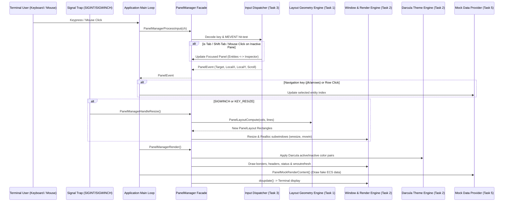

# Feature Technical Specification: Multi-Pane TUI Layout & Navigation Framework

> **Instructions**: This document consolidates the 3 core technical design pillars agreed upon during task planning. It serves as the single source of truth comment on the Parent Feature issue.

## Document Governance

| Field | Details |
|---|---|
| **Feature Issue** | #17 |
| **Status** | Approved |
| **Lead Engineer** | Antigravity Lead Engineer |
| **Last Updated** | 2026-08-14 |

---

# 📄 Document 1: Public Interface & Usage Specification

> **Goal**: Define the public contract and show how consumers will interact with this feature.

## 1.1 Public API & Class Signatures

### Header 1: `panel_types.h`
```c
/**
 * @file panel_types.h
 * @brief Common types, geometry primitives, and event structures for panels.
 */
#pragma once

#include <stdbool.h>
#include <stdint.h>
#include <curses.h>
#include "flecs_explorer/common/common.h"

#ifdef __cplusplus
extern "C" {
#endif

/**
 * @brief Identifiers for each panel managed in the framework.
 */
typedef enum PanelId {
    PANEL_HEADER = 0,    /**< Top panel: World statistics & connection telemetry */
    PANEL_ENTITIES = 1,  /**< Left panel: ECS entity tree & table browser */
    PANEL_INSPECTOR = 2, /**< Right panel: Live component data inspector */
    PANEL_STATUS = 3,    /**< Bottom footer: Key shortcuts & status message */
    PANEL_COUNT = 4
} PanelId;

/**
 * @brief Event classifications emitted by panel input processing.
 */
typedef enum PanelEventType {
    PANEL_EVENT_NONE = 0,
    PANEL_EVENT_KEY,
    PANEL_EVENT_MOUSE_CLICK,
    PANEL_EVENT_MOUSE_SCROLL,
    PANEL_EVENT_FOCUS_CHANGED,
    PANEL_EVENT_RESIZE,
    PANEL_EVENT_QUIT
} PanelEventType;

/**
 * @brief 2D bounding box rectangle for panel coordinate positioning.
 */
typedef struct PanelRect {
    int x;
    int y;
    int width;
    int height;
} PanelRect;

/**
 * @brief Multi-panel layout calculation result.
 */
typedef struct PanelLayout {
    int screenWidth;
    int screenHeight;
    bool isTooSmall;            /**< True if terminal < 80x24 */
    PanelRect headerRect;       /**< Bounding box for Top Header */
    PanelRect entitiesRect;     /**< Bounding box for Left Entity Panel */
    PanelRect inspectorRect;    /**< Bounding box for Right Inspector Panel */
    PanelRect statusRect;       /**< Bounding box for Bottom Status Footer */
} PanelLayout;

/**
 * @brief Unified event payload routed to active panels.
 */
typedef struct PanelEvent {
    PanelEventType type;
    int key;                    /**< Curses key code for PANEL_EVENT_KEY */
    PanelId targetPanel;        /**< Destination panel */
    int localX;                 /**< Panel-relative X coordinate (0-indexed inside border) */
    int localY;                 /**< Panel-relative Y coordinate (0-indexed inside border) */
    int scrollDelta;            /**< +1 scroll down, -1 scroll up */
} PanelEvent;

/**
 * @brief Configuration parameters for initializing the Panel Manager.
 */
typedef struct PanelConfig {
    int minWidth;               /**< Minimum required width (default: 80) */
    int minHeight;              /**< Minimum required height (default: 24) */
    double entityPanelRatio;    /**< Width ratio for entity panel (default: 0.35) */
    bool enableMouse;           /**< Enable terminal mouse reporting (default: true) */
    bool enableColors;          /**< Enable color pairs (default: true) */
    bool useDarculaTheme;       /**< Enable JetBrains Darcula theme (default: true) */
} PanelConfig;

/**
 * @brief Opaque handle representing the Panel Manager subsystem.
 */
typedef struct PanelManager PanelManager;

#ifdef __cplusplus
}
#endif
```

### Header 2: `panel_layout.h`
```c
/**
 * @file panel_layout.h
 * @brief Pure geometric calculations for multi-panel screen partitioning.
 */
#pragma once

#include "panel_types.h"

#ifdef __cplusplus
extern "C" {
#endif

/**
 * @brief Computes screen partition rectangles for all panels given screen dimensions.
 *
 * Pure function: operates without curses dependency for headless testing.
 *
 * @param width Total screen width in columns.
 * @param height Total screen height in rows.
 * @param entityRatio Desired width ratio for entity panel (0.1 to 0.9, e.g. 0.35).
 * @param minWidth Minimum supported width (e.g. 80).
 * @param minHeight Minimum supported height (e.g. 24).
 * @param[out] outLayout Output struct populated with panel rectangles and isTooSmall flag.
 * @return APP_OK on success, APP_ERROR_INVALID_ARGUMENT if outLayout is NULL.
 */
AppResult PanelLayoutCompute(int width,
                            int height,
                            double entityRatio,
                            int minWidth,
                            int minHeight,
                            PanelLayout *outLayout);

/**
 * @brief Checks if given dimensions meet minimum display constraints.
 */
bool PanelLayoutIsTooSmall(int width, int height, int minWidth, int minHeight);

/**
 * @brief Performs 2D hit-testing to identify which panel contains point (x, y).
 *
 * @param layout Current calculated layout.
 * @param screenX Global screen column (0-indexed).
 * @param screenY Global screen row (0-indexed).
 * @param[out] outPanel Detected PanelId.
 * @param[out] outLocalX Column relative to panel top-left.
 * @param[out] outLocalY Row relative to panel top-left.
 * @return true if point is inside a panel, false if outside screen.
 */
bool PanelLayoutHitTest(const PanelLayout *layout,
                        int screenX,
                        int screenY,
                        PanelId *outPanel,
                        int *outLocalX,
                        int *outLocalY);

#ifdef __cplusplus
}
#endif
```

### Header 3: `panel_theme.h`
```c
/**
 * @file panel_theme.h
 * @brief JetBrains CLion Darcula theme palette and curses color pair setup.
 */
#pragma once

#include <stdbool.h>
#include <curses.h>
#include "flecs_explorer/common/common.h"

#ifdef __cplusplus
extern "C" {
#endif

/**
 * @brief Semantic color pairs modeled after CLion Darcula.
 */
typedef enum PanelColorPair {
    PANEL_COLOR_DEFAULT = 1,         /**< Primary text (#A9B7C6 on #2B2B2B) */
    PANEL_COLOR_CHROME = 2,          /**< Panel chrome (#A9B7C6 on #313335) */
    PANEL_COLOR_BORDER_ACTIVE = 3,   /**< Focused border (#FFC66D on #2B2B2B) */
    PANEL_COLOR_BORDER_INACTIVE = 4, /**< Unfocused border (#808080 on #2B2B2B) */
    PANEL_COLOR_SELECTION = 5,       /**< Selection highlight (#FFFFFF on #214283) */
    PANEL_COLOR_STATUS_ONLINE = 6,   /**< Online indicator (#6A8759 on #313335) */
    PANEL_COLOR_STATUS_WARN = 7,     /**< Reconnecting (#CC7832 on #313335) */
    PANEL_COLOR_STATUS_ERROR = 8,    /**< Offline error (#BC3F3C on #313335) */
    PANEL_COLOR_NUMERIC = 9,         /**< Constants / Numbers (#6897BB on #2B2B2B) */
    PANEL_COLOR_KEYWORD = 10         /**< Shortcuts & Badges (#CC7832 on #313335) */
} PanelColorPair;

/**
 * @brief Initializes curses colors and color pairs matching Darcula theme.
 *
 * If terminal supports custom colors (can_change_color()), exact Darcula RGB values
 * are mapped. Otherwise, maps to closest 256-color / 16-color ANSI fallbacks.
 */
AppResult PanelThemeInit(bool enableColors);

/**
 * @brief Applies the specified color pair attribute to a curses WINDOW.
 */
void PanelThemeApplyPair(WINDOW *win, PanelColorPair pair);

#ifdef __cplusplus
}
#endif
```

### Header 4: `panel_mock.h`
```c
/**
 * @file panel_mock.h
 * @brief Mock ECS data generator and visual testing harness for panels.
 */
#pragma once

#include "panel_types.h"

#ifdef __cplusplus
extern "C" {
#endif

typedef struct MockComponent {
    char name[64];
    char jsonValue[512];
} MockComponent;

typedef struct MockEntity {
    char name[64];
    char path[128];
    uint64_t id;
    int componentCount;
    MockComponent components[8];
} MockEntity;

typedef struct MockWorldData {
    char worldName[64];
    char serverUrl[128];
    double fps;
    int entityCount;
    int tableCount;
    int systemCount;
    uint64_t latencyMs;
    const char *status;
    int selectedEntityIndex;
    int totalEntities;
    MockEntity entities[32];
} MockWorldData;

/**
 * @brief Populates a MockWorldData structure with realistic Flecs ECS entities and telemetry.
 */
void PanelMockWorldDataInit(MockWorldData *data);

/**
 * @brief Renders mock content inside the given panel window using Darcula styling.
 */
void PanelMockRenderContent(WINDOW *win, PanelId panel, const MockWorldData *data, bool isFocused);

#ifdef __cplusplus
}
#endif
```

### Header 5: `panel_manager.h`
```c
/**
 * @file panel_manager.h
 * @brief Primary facade for panel lifecycle, input dispatching, focus, and rendering.
 */
#pragma once

#include "panel_types.h"
#include "panel_layout.h"
#include "panel_theme.h"
#include "panel_mock.h"

#ifdef __cplusplus
extern "C" {
#endif

/**
 * @brief Allocates and initializes a new PanelManager instance.
 */
AppResult PanelManagerCreate(const PanelConfig *config, PanelManager **outManager);

/**
 * @brief Sets up terminal (ncurses, cbreak, noecho, keypad, mouse reporting).
 */
AppResult PanelManagerInitTerminal(PanelManager *manager);

/**
 * @brief Restores terminal modes, cursor visibility, and releases curses state cleanly.
 */
void PanelManagerRestoreTerminal(PanelManager *manager);

/**
 * @brief Frees all windows, layout memory, and the PanelManager instance.
 */
void PanelManagerDestroy(PanelManager *manager);

/**
 * @brief Recalculates layout and reallocates pane WINDOWs on terminal resize.
 */
AppResult PanelManagerHandleResize(PanelManager *manager);

/**
 * @brief Decodes raw keyboard / mouse events into structured PanelEvents and handles focus.
 */
AppResult PanelManagerProcessInput(PanelManager *manager, int ch, PanelEvent *outEvent);

/**
 * @brief Renders window borders, focus highlights, titles, and panel surfaces.
 */
AppResult PanelManagerRender(PanelManager *manager);

/**
 * @brief Explicitly sets the focused panel.
 */
void PanelManagerSetFocus(PanelManager *manager, PanelId panel);

/**
 * @brief Returns the currently focused panel ID.
 */
PanelId PanelManagerGetFocus(const PanelManager *manager);

/**
 * @brief Cycles focus forward (Entity Panel -> Inspector Panel -> Entity Panel).
 */
void PanelManagerFocusNext(PanelManager *manager);

/**
 * @brief Cycles focus backward (Inspector Panel -> Entity Panel -> Inspector Panel).
 */
void PanelManagerFocusPrev(PanelManager *manager);

/**
 * @brief Retrieves the underlying ncurses WINDOW pointer for a specific panel.
 */
WINDOW *PanelManagerGetWindow(PanelManager *manager, PanelId panel);

/**
 * @brief Retrieves the bounding box rectangle for a specific panel.
 */
PanelRect PanelManagerGetRect(const PanelManager *manager, PanelId panel);

/**
 * @brief Returns the current active layout snapshot.
 */
const PanelLayout *PanelManagerGetLayout(const PanelManager *manager);

/**
 * @brief Returns true if current terminal size is below minimum required resolution.
 */
bool PanelManagerIsTooSmall(const PanelManager *manager);

#ifdef __cplusplus
}
#endif
```

---

## 1.2 Data Structures & Schemas

### Geometry & Layout Types
- `PanelRect`: `{ int x, y, width, height; }`
- `PanelLayout`: Complete screen arrangement containing `headerRect`, `entitiesRect`, `inspectorRect`, `statusRect`, and boolean `isTooSmall`.
- `PanelConfig`: Minimum dimensions (80x24), entity ratio (0.35), mouse flag, color flag, Darcula theme flag.

### Event & Mock Models
- `PanelEvent`: Carries event type (`PANEL_EVENT_KEY`, `PANEL_EVENT_MOUSE_CLICK`, `PANEL_EVENT_MOUSE_SCROLL`, `PANEL_EVENT_FOCUS_CHANGED`, `PANEL_EVENT_RESIZE`, `PANEL_EVENT_QUIT`), `targetPanel`, local `(x, y)` relative to the panel border, `scrollDelta`, and keycode.
- `MockWorldData`: Mock container for testing visual display with realistic entities (`Player`, `Enemy_01`, `Camera`, `Light`), components (`Position`, `Velocity`, `Health`), and header telemetry.

---

## 1.3 Usage Guide & Complete Code Example

```c
#include "flecs_explorer/panel/panel_manager.h"
#include <stdio.h>

int main(void) {
    PanelConfig config = {
        .minWidth = 80,
        .minHeight = 24,
        .entityPanelRatio = 0.35,
        .enableMouse = true,
        .enableColors = true,
        .useDarculaTheme = true
    };

    PanelManager *manager = NULL;
    if (PanelManagerCreate(&config, &manager) != APP_OK) {
        fprintf(stderr, "Failed to create panel manager\n");
        return 1;
    }

    if (PanelManagerInitTerminal(manager) != APP_OK) {
        fprintf(stderr, "Failed to initialize terminal\n");
        PanelManagerDestroy(manager);
        return 1;
    }

    // Initialize mock data for visual verification
    MockWorldData mockData;
    PanelMockWorldDataInit(&mockData);

    bool running = true;
    while (running) {
        // 1. Render all panel chrome & borders
        PanelManagerRender(manager);

        // 2. Render mock panel content
        for (int p = 0; p < PANEL_COUNT; ++p) {
            WINDOW *win = PanelManagerGetWindow(manager, (PanelId)p);
            bool isFocused = (PanelManagerGetFocus(manager) == (PanelId)p);
            PanelMockRenderContent(win, (PanelId)p, &mockData, isFocused);
        }
        doupdate();

        // 3. Fetch input character
        int ch = getch();

        // 4. Process input into event
        PanelEvent event;
        if (PanelManagerProcessInput(manager, ch, &event) == APP_OK) {
            switch (event.type) {
                case PANEL_EVENT_QUIT:
                    running = false;
                    break;

                case PANEL_EVENT_RESIZE:
                    PanelManagerHandleResize(manager);
                    break;

                case PANEL_EVENT_MOUSE_CLICK:
                    if (event.targetPanel == PANEL_ENTITIES && event.localY >= 1) {
                        int clickedIndex = event.localY - 1;
                        if (clickedIndex < mockData.totalEntities) {
                            mockData.selectedEntityIndex = clickedIndex;
                        }
                    }
                    break;

                case PANEL_EVENT_KEY:
                    if (event.key == 'j' || event.key == KEY_DOWN) {
                        if (mockData.selectedEntityIndex < mockData.totalEntities - 1) {
                            mockData.selectedEntityIndex++;
                        }
                    } else if (event.key == 'k' || event.key == KEY_UP) {
                        if (mockData.selectedEntityIndex > 0) {
                            mockData.selectedEntityIndex--;
                        }
                    }
                    break;

                default:
                    break;
            }
        }
    }

    // 5. Clean shutdown and terminal restoration
    PanelManagerRestoreTerminal(manager);
    PanelManagerDestroy(manager);
    return 0;
}
```

---

## 1.4 Error Handling & Guarantees

- **Return Codes**: All operational APIs return `AppResult` (`APP_OK`, `APP_ERROR_INVALID_ARGUMENT`, `APP_ERROR_OUT_OF_MEMORY`, `APP_ERROR_SYSTEM`).
- **Terminal Restoration**: `PanelManagerRestoreTerminal` is safe, idempotent, and callable from signal handlers (`SIGINT`, `SIGTERM`).
- **Memory Safety**: Destroying the manager frees all curses subwindows (`delwin`) and clears structures cleanly. Zero memory leaks when run under ASan / Valgrind.
- **Graceful Degradation**: If terminal is resized below 80x24, windows are hidden and a centered warning box is displayed until resized back to valid dimensions.

---

# 📄 Document 2: Feature Architecture & Task Decomposition

> **Goal**: Detail the internal architecture, decompose the feature into sequenced tasks, and show how they interact.

## 2.1 Subsystem Architecture & Interaction Flow



---

## 2.2 Architectural Decisions (ADRs)

- **ADR-01: Pure Functional Separation for Layout Geometry**
  - **Context**: Testing `ncurses` UI code in automated CI without an interactive TTY often causes failures or requires complex mock drivers.
  - **Decision**: Separate layout math into `panel_layout.c` with zero curses dependencies.
  - **Trade-offs**: Requires copying rectangle definitions into curses window allocation calls, but delivers 100% deterministic, headless unit testability.

- **ADR-02: JetBrains Darcula Theme with Graceful 256/16-Color Fallbacks**
  - **Context**: Provide a professional IDE look and feel matching CLion Darcula.
  - **Decision**: Define exact RGB palette (scaled 0–1000) initialized via `init_color` when `can_change_color()` is true, while setting standard ANSI 256-color and 16-color fallbacks.
  - **Trade-offs**: Enhances visual fidelity on modern terminals (xterm-256color, Kitty, Alacritty) while remaining fully legible on legacy terminals.

- **ADR-03: Two-Phase Screen Rendering (`wnoutrefresh` + `doupdate`)**
  - **Context**: Refreshing 4 separate panel windows individually causes screen flickering and tear artifacts.
  - **Decision**: Each panel renders to its virtual buffer via `wnoutrefresh()`, followed by a single atomic `doupdate()` call per frame.
  - **Trade-offs**: Completely eliminates visual flicker during resizing and high-frequency state updates.

- **ADR-04: Mock Data Provider & Visual Test Harness**
  - **Context**: Visualizing and validating multi-pane navigation, focus highlights, row selections, and theme styling before live ECS REST integration is in place.
  - **Decision**: Provide a dedicated mock data generator (`panel_mock.c`) and visual demo mode (`--demo` / interactive test) populating realistic entities and components.
  - **Trade-offs**: Adds a lightweight mock module, but enables instant interactive verification of the entire UI feel.

---

## 2.3 Granular Task Decomposition

1. **[Multi-Pane Layout] Task 1: Public Interface, Core Layout Engine & Test Scaffolding**
   - **Scope**: Define public headers (`panel_types.h`, `panel_layout.h`, `panel_manager.h`, `panel_theme.h`, `panel_mock.h`). Implement pure layout computation engine (`src/panel/panel_layout.c`), rectangle bounding math, `isTooSmall` checks (< 80x24), and hit-testing (`PanelLayoutHitTest`). Create base test scaffolding (`tests/panel/test_panel_layout.c`).
   - **Deliverable**: Compilable headers, functional layout calculation library, and unit test suite passing in CI.

2. **[Multi-Pane Layout] Task 2: Darcula Theme Engine, Panel Window Management & Multi-Panel Rendering**
   - **Scope**: Implement `src/panel/panel_theme.c` with Darcula RGB color pairs and ANSI fallbacks. Implement `src/panel/panel_window.c` for `ncurses` window creation, destruction, dynamic resizing (`wresize`, `mvwin`), active/inactive focus border styling, header panel bar, and status footer bar. Add unit tests (`tests/panel/test_panel_window.c` and `tests/panel/test_panel_theme.c`).
   - **Deliverable**: Window management, theme subsystem, border rendering, and resize reallocation.

3. **[Multi-Pane Layout] Task 3: Input Dispatcher, Focus Navigation & Mouse Event Engine**
   - **Scope**: Implement `src/panel/panel_input.c`. Decode keyboard shortcuts (`Tab`, `Shift-Tab` / `KEY_BTAB`, `j`/`k`, arrows, `q`, `KEY_RESIZE`), parse `MEVENT` coordinates, perform hit-testing to map mouse clicks to active/target panels, calculate scroll wheel deltas, and manage focus state switching between Entity and Inspector panels. Add unit tests (`tests/panel/test_panel_input.c`).
   - **Deliverable**: Robust input decoder and focus transition engine.

4. **[Multi-Pane Layout] Task 4: Terminal Lifecycle, Signal Trapping & Full Panel Integration**
   - **Scope**: Implement `src/panel/panel_manager.c` and `src/panel/panel_signals.c`. Handle terminal initialization (`cbreak`, `noecho`, `keypad`, mouse reporting), signal handling (`SIGINT`, `SIGTERM`, `SIGWINCH`), clean exit restoration (`PanelManagerRestoreTerminal`), unified test suite runner (`tests/panel/test_panel.c`), and CTest / CMake target wiring.
   - **Deliverable**: End-to-end multi-panel framework ready for consumption by Entity Browser and Component Inspector features.

5. **[Multi-Pane Layout] Task 5: Mock Data Provider & Interactive Visual Test Harness**
   - **Scope**: Implement `src/panel/panel_mock.c` to generate realistic Flecs ECS world data (header stats, entities list, component properties). Wire an interactive visual testing mode into `src/main.c` allowing developers to navigate mock entities (`j`/`k`, Up/Down, click selection), inspect mock component values in Darcula syntax styling, test mouse wheel scrolling, switch focus (`Tab`), and verify resizing. Add mock data unit tests (`tests/panel/test_panel_mock.c`).
   - **Deliverable**: Interactive visual test harness and mock data generator.

---

## 2.4 Task Interaction & Dependency Matrix

| Task | Depends On | Interacts With | Role in Overall Feature |
|---|---|---|---|
| **Task 1** | None | Common error types (`common.h`) | Provides foundational headers, geometry models, and pure layout calculation engine |
| **Task 2** | Task 1 | Task 1 Layout Rects & ncurses | Implements Darcula theme, window allocation, resize logic, and border rendering |
| **Task 3** | Task 1, Task 2 | Task 1 Hit-Testing & Task 2 Focus State | Decodes keyboard/mouse inputs and routes events to the target panel |
| **Task 4** | Task 1, Task 2, Task 3 | OS signals & CTest runner | Unifies lifecycle, signal trapping, graceful exit, and test suite integration |
| **Task 5** | Tasks 1, 2, 3, 4 | PanelManager, Window renderers & Theme | Provides realistic fake ECS data for interactive visual testing and manual UI validation |

---

# 📄 Document 3: Agreed Test Plan & Verification Strategy

> **Goal**: Define the test cases and verification methodology to prove correctness.

## 3.1 Key Test Scenarios

### Critical Paths (Happy Path)
1. **Standard Layout Partitioning**:
   - Verify layout math for standard dimensions: `80x24`, `120x40`, `180x50`.
   - Verify Header height is 3, Status height is 1, and center height is `Height - 4`.
   - Verify Entity panel width equals `floor(Width * 0.35)` and Inspector takes remaining width.
2. **Focus Navigation**:
   - Initial focus defaults to `PANEL_ENTITIES`.
   - `Tab` key or `PanelManagerFocusNext` switches focus to `PANEL_INSPECTOR`.
   - Subsequent `Tab` cycles focus back to `PANEL_ENTITIES`.
   - `Shift-Tab` cycles focus in reverse.
3. **Mouse Hit-Testing & Pane Activation**:
   - Click at coordinate `(10, 5)` maps to `PANEL_ENTITIES` with local coordinate `(9, 3)` (relative to inner border).
   - Click at coordinate `(50, 10)` maps to `PANEL_INSPECTOR` and automatically updates focus.
   - Mouse wheel events on either panel generate correct `scrollDelta` (+1 or -1).
4. **Darcula Theme Initialization**:
   - Color pairs 1–10 initialize successfully without crashing on standard color terminals.
   - Color attributes apply active gold border to focused pane and gray border to inactive pane.
5. **Mock Data Rendering & Interactive Navigation**:
   - Mock world initializes with valid entity trees and JSON properties.
   - Arrow keys / `j`/`k` move selection index and render highlighted row (`PANEL_COLOR_SELECTION`).
   - Inspector updates live when selected entity changes.

### Edge Cases & Failure Modes
6. **Undersized Terminal Protection**:
   - Dimensions `< 80` width or `< 24` height (e.g. `79x24`, `80x23`, `50x15`) set `isTooSmall = true`.
   - Hit-testing returns `false` when `isTooSmall` is true.
   - Render displays centered warning message without creating overlapping subwindows.
7. **Zero & Negative Dimension Boundary**:
   - `PanelLayoutCompute` with negative or zero width/height safely returns `APP_ERROR_INVALID_ARGUMENT` or clamps gracefully.
8. **Signal & Clean Teardown**:
   - Triggering clean exit or simulated `SIGINT` restores terminal mode and cursor visibility cleanly without leaking curses state.

---

## 3.2 Testing Approach & Mocking Strategy

- **Pure Layout Unit Tests (`test_panel_layout.c`)**: 100% headless, pure arithmetic assertions without ncurses init.
- **Input Decoding Unit Tests (`test_panel_input.c`)**: Mock key codes and synthetic `MEVENT` payloads to verify event translation and coordinate hit-testing.
- **Theme & Window Tests (`test_panel_window.c`, `test_panel_theme.c`)**: Headless curses / virtual screen tests verifying window lifecycle, border formatting, and color pair mappings.
- **Mock Data Unit Tests (`test_panel_mock.c`)**: Validates mock ECS data structure creation, selection bounds, and memory safety.
- **Integration Tests (`test_panel.c`)**: Full lifecycle integration test exercising creation, rendering, resize handling, and teardown under AddressSanitizer and UndefinedBehaviorSanitizer.
- **Interactive Visual Test Harness**: Running `./flecs_explorer` displays the full Darcula multi-pane UI with live fake data for instant manual verification.

---

## 3.3 Acceptance Benchmarks (FRD Validation)

- [ ] All unit and integration test suites pass 100% with `ctest --output-on-failure`.
- [ ] Zero memory leaks and zero undefined behavior detected by ASan/UBSan.
- [ ] Multi-pane layout dynamically adapts to terminal resizes (`SIGWINCH` / `KEY_RESIZE`).
- [ ] Mouse clicks switch focus and mouse wheel scrolls inside panels.
- [ ] Terminal state (raw/cursor) restores cleanly on exit.
- [ ] Interactive mock harness renders realistic fake ECS data with keyboard & mouse navigation.
